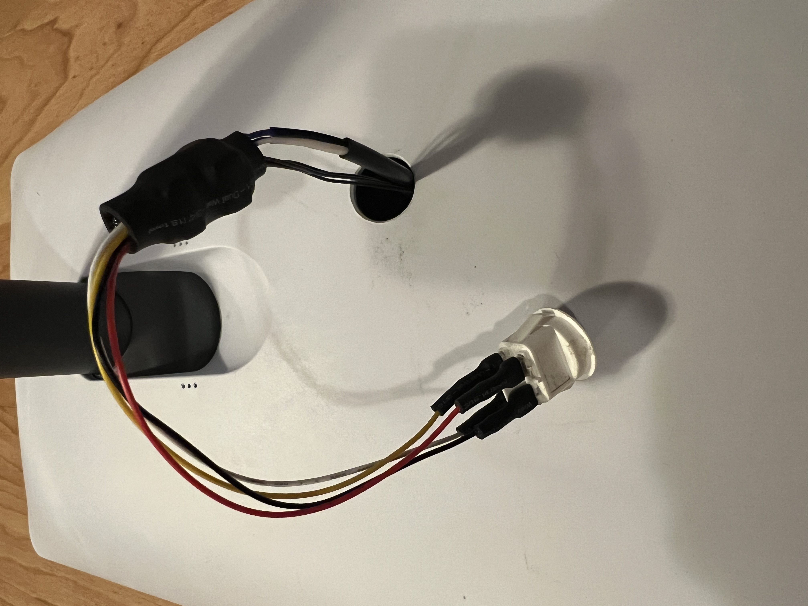

# dishy-motor-disable-switch

## Description

PCB to add a switch to disable Starlink Dishy motors without splicing any wires.

## Bill of Materials

Part | Quantity
--- | ---
[Switch PCB](./Gerber%20Files.zip) | 1
[DPST Switch](https://www.digikey.com/en/products/detail/e-switch/RR812C2211/4029165) | 1
[SM05B-ZESS-TB](https://www.digikey.com/en/products/detail/jst-sales-america-inc/SM05B-ZESS-TB-LF-SN/1887004) Motor Connector (Female) | 2
[ZER-05V-S](https://www.digikey.com/en/products/detail/jst-sales-america-inc/ZER-05V-S/1887020) Motor Connector (Male) | 2
[JUMPER SZE-002T-P0.3 X2](https://www.digikey.com/en/products/detail/jst-sales-america-inc/ASZESZE26K102/9960101) 4" Motor Cables | 4
[S4B-PH-SM4-TB](https://www.digikey.com/en/products/detail/jst-sales-america-inc/S4B-PH-SM4-TB/926657) Switch Connector | 1
[Micro Jst 2.0 Ph](https://www.amazon.com/Micro-Connector-150mm-Cable-Female/dp/B01DUC1S7S/ref=sr_1_5?crid=3858QF03C4LIL&keywords=Micro+Jst+2.0+Ph&qid=1701401680&sprefix=micro+jst+2.0+ph%2Caps%2C142&sr=8-5) Switch Cables | 1
[Drill Location Template](./Drill%20Location%20Template.pdf) 1:1 Scale | 1

## Install

### 1. (Optional) Waterproof the Switch

It's recommended to add some sort of waterproofing to the switch if you don't have a waterproof switch. There are [covers you can buy](https://a.co/d/dtk1Wfd), but I opted to just add a bit of silicone to my switch to plug any holes.

### 2. Drill Hole for Switch

Using the [drill location template](./Drill%20Location%20Template.pdf) printed at a 1:1 scale, make a mark where the center of the whole will be drilled. The "Bottom" secion of the template should lie along the bottom edge of the dish and the "Right" section along the right side (See image for reference). When stowed, the Dishy pole points to the "Bottom" edge.

The hole needed for your switch may vary. Cut whatever size makes sense for your switch.

I used a step bit to cut a hole of 13/16" (20.6mm) in diameter.

### 3. Connect Wire to Switch

**⚠️ Add heat shrink tubing to wires before connecting to switch.**

A Dual Pole Single Throw (DPST) switch will have two isolated switch circuits built in. Pins 1 and 2 (Red and Black) from the PCB will go to one circuit of the switch (Terminal 1A and 2A). Pins 3 and 4 (Yellow and White) will go to the other switch circuit (Terminal 3B and 4B). The names of the pins on the switch don't really matter, as long as pins 1 and 2 from the PCB are on one switch circuit and pins 3 and 4 are on the other.

### 4. Make the Connections

The PCB has two connectors that are identical to what is on the Dish PCB for the motors. It doesn't matter which ones go to the Dish PCB or to the Motors in the Dish.

Disconnect the Dishy motor connector from the Dish and connect to the switch PCB. Attach the 4 wire pigtail to the PCB inside Dishy and then to the switch PCB. Connect the switch to the PCB.

(Image provided by Matt K)

### 5. Heat Shrink Everything

In order to prevent any short circuiting inside of the Dish. It is recommended to wrap the switch terminals and the PCB with heat shrink tubing.

### 6. Install Switch

You will want to add some sort of sealant to the switch. I wanted the ability to remove the switch in the future just in case, so I opted for silicone. Super glue should also work if you're okay with a more permanent install.

